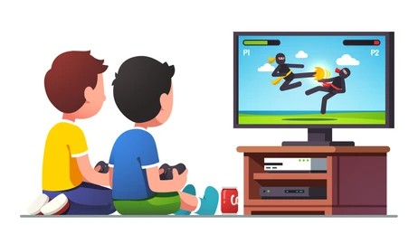

<h1 align="center"> Game Fight </h1>

Exclusive course, promoted by Rocketseat for teaching web technologies.

  <a href="#-tecnologias">Technologies</a>&nbsp;&nbsp;&nbsp;|&nbsp;&nbsp;&nbsp;
  <a href="#-applications">Applications</a>&nbsp;&nbsp;&nbsp;|&nbsp;&nbsp;&nbsp;
  <a href="#-projeto">Project</a>&nbsp;&nbsp;&nbsp;|&nbsp;&nbsp;&nbsp;
  <a href="#-layout">Layout</a>&nbsp;&nbsp;&nbsp;|&nbsp;&nbsp;&nbsp;
  <a href="#memo-licença">License</a>

  

 

## 🚀 Technologies

This project was developed with the following technologies:

- Python

## 🔧 Applications

- Object-Oriented Programming
- Classes and Objects
- Inheritance
- Encapsulation
- Polymorphism

## 💻 Project

It is a project that allows the user (hero character) to perform actions such as attacking the enemy with two types of powers until they deplete the enemy's health and win the battle.

## 🔖 Layout

You can view the project layout through [THIS LINK](https://github.com/Tavinhoviana/GameFight).

## :memo: License

This project is under the MIT license.
---